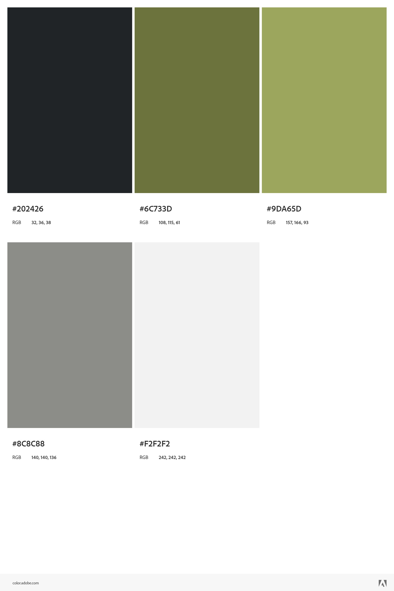
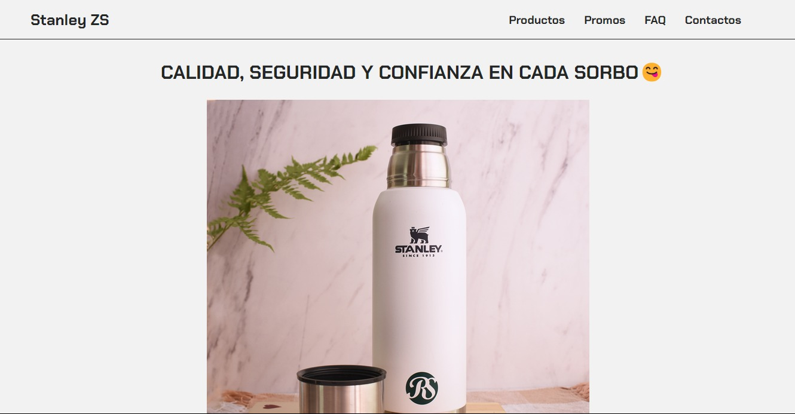
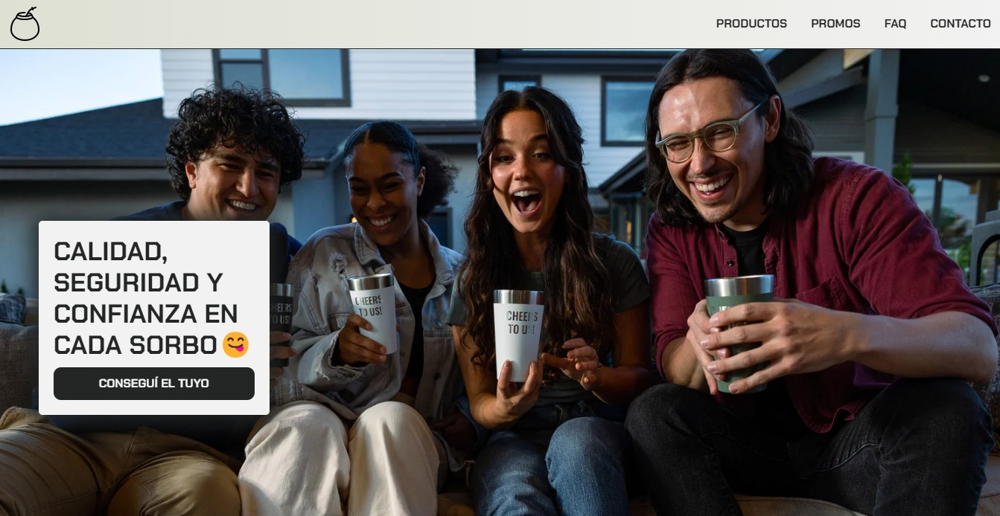

# stanley-project🧉❤️

¡Hey there! En este repositorio podrán ver un poco de mi trabajo: cómo escribo código, cómo pienso y cómo organizo mi proyecto. Espero que se lleven una buena primera impresión; si no es así, acuérdense de que siempre hay revancha. 😋👋🏻

link repo: https://github.com/francolgonzalez/PreEntrega3GonzalezFranco

link deployment: https://francolgonzalez.github.io/PreEntrega3GonzalezFranco/

link del hosting: https://stanleyproject-francogonzalez.netlify.app/

El intento de e-commerce no está ni cerca de lo que tenía en mente al principio del curso, o bueno, en mi mente capaz que sí, pero no en el código. 😂

Empezamos con unos wireframes bastante criticables, pero yo sentía que estaba diseñando la nueva versión de la página de Stanley USA. Desde el primer momento supe que soy un buen creador de wireframes... solo de wireframes. 🥴

        __________________     
      
        WIREFRAMES DESKTOP:
        __________________

https://wireframe.cc/oWkmEa - INICIO

https://wireframe.cc/LgkaQ5 - PRODUCTOS

https://wireframe.cc/VFOxEe - PROMOS

https://wireframe.cc/uNU79U - FAQ

https://wireframe.cc/HyXlvU - CONTACTO

        __________________
        
        WIREFRAMES MOBILE: 
        __________________

https://wireframe.cc/1GrbK4 - INICIO

https://wireframe.cc/aUvDXd - PRODUCTOS

https://wireframe.cc/CLsSbQ - PROMOS

https://wireframe.cc/mXbTFc - FAQ

https://wireframe.cc/c1SvBy - CONTACTO

Después de crear la 8va maravilla del mundo con los wireframes, quise adaptar una paleta de colores que creía que iba a ir bien con el estilo de la marca, pero no fue así; tenía más pinta de árbol de navidad que de página web. Por eso mismo, no soy UI Designer. 🫠

Después de darme cuenta de que esa página no iba con lo que tenía en mente, decidí ir por una idea más minimalista, como me gusta a mí, y dejar de agregar cosas que no sumaban. Así que me puse manos a la obra para rediseñar la página desde cero antes de la primera preentrega. 💻🦾

Un par de horas de codeo más tarde, había conseguido un resultado que me dejaba bastante más contento que la versión anterior de la página. 😁

A medida que fueron pasando las preentregas, la página se fue adaptando cada vez más a lo que quería, adquiría nuevos conocimientos y los plasmaba en la página. Investigaba por mi cuenta y agregaba lo que mejor me parecía para el estilo de la misma. 🤓 Terminando la última preentrega, la tercera, la página había quedado como quería 🥹; solamente quedaba pulir detalles mínimos para dar como finalizado mi primer proyecto como Desarrollador Web. 🦾🚀 

Y así doy por terminado mi proyecto de e-commerce en CoderHouse, una muy buena experiencia que se debe a la excelente profesora que nos tocó, que más allá de su habilidad para enseñar y plasmar sus conocimientos en cada clase, destaco lo excelente persona que es, la dedicación que tiene con su trabajo y la predisposición para ayudar a quien lo necesite. Más que agradecido con ella y con mis compañeros. ¡Agárrate JavaScript, porque voy por vos! 😈